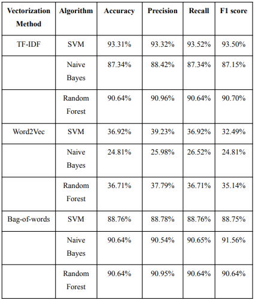

# **Text Classification Project**

This repository contains a text classification project focused on classifying news articles into predefined categories using various machine learning algorithms and vectorization techniques.

## **Project Structure:**

01_Raw_Collected_dataset: Contains the raw dataset collected through web scraping.

02_Final_Combined_Dataset: Includes the cleaned and finalized dataset ready for model training and testing.

03_Training_code: Includes training scripts for three classification algorithms (Naive Bayes, Random Forest, SVM) using different vectorization techniques:

04_Trained_models: Contains saved trained models after training with the dataset.

05_Testing_code: Includes scripts for testing the trained models:
input_link.py: Takes news article links as input and provides classification output.
input_newstext.py: Takes raw text as input and provides classification output.
Usage

## **Data Collection:** 
Raw data was collected using web scraping and stored in 01_Raw_Collected_dataset.

## **Data Cleaning and Preparation:** 
The collected data was cleaned and combined into a finalized dataset stored in 02_Final_Combined_Dataset.

## **Model Training:** 
Use the scripts in 03_Training_code to train the models using different algorithms and vectorization techniques.

## **Testing:** 
Use the scripts in 05_Testing_code to test the trained models either with news article links (input_link.py) or raw text (input_newstext.py).

## **Requirements**
Python Libraries: numpy, pandas, scikit-learn, gensim (for Word2Vec), nltk (for text preprocessing), beautifulsoup4 (for web scraping)

1. Install the required Python libraries:
`pip install -r requirements.txt`

2. You just need to paste the input article links in input_link.py

## **Results**
